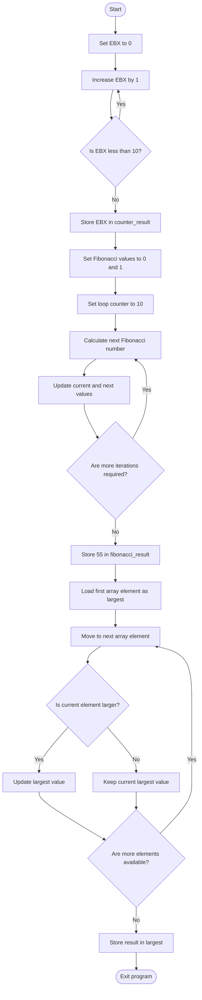

# Loops and Arrays in Assembly Language

## Objective

The objective of this lab is to learn how to implement loops and arrays using NASM x86 Assembly language. The program performs the following tasks:

1. Generates a counter using the `EBX` register.
2. Calculates a Fibonacci result of `55`.
3. Finds the largest element in an integer array of length three.

## Program Results

| Task                  | Stored Variable    | Expected Value |
| --------------------- | ------------------ | -------------: |
| Counter               | `counter_result`   |             10 |
| Fibonacci             | `fibonacci_result` |             55 |
| Largest array element | `largest`          |             45 |

## Assembly Code

```nasm
; Loops and Arrays Lab
; NASM x86 Assembly for Linux
;
; Expected results:
; counter_result   = 10
; fibonacci_result = 55
; largest          = 45

section .data
    ; Integer array containing three elements
    numbers dd 12, 45, 27
    array_length equ 3

section .bss
    counter_result   resd 1
    fibonacci_result resd 1
    largest          resd 1

section .text
    global _start

_start:

; ---------------------------------------------------------
; Task 1: Generate a counter using the EBX register
; ---------------------------------------------------------

    xor ebx, ebx

counter_loop:
    inc ebx
    cmp ebx, 10
    jl counter_loop

    mov [counter_result], ebx


; ---------------------------------------------------------
; Task 2: Calculate the Fibonacci result
; ---------------------------------------------------------

    xor eax, eax
    mov edx, 1
    mov ecx, 10

fibonacci_loop:
    mov esi, eax
    add esi, edx
    mov eax, edx
    mov edx, esi
    loop fibonacci_loop

    mov [fibonacci_result], eax


; ---------------------------------------------------------
; Task 3: Find the largest array element
; ---------------------------------------------------------

    mov esi, numbers
    mov eax, [esi]
    mov ecx, array_length - 1
    add esi, 4

largest_loop:
    cmp eax, [esi]
    jge next_element

    mov eax, [esi]

next_element:
    add esi, 4
    loop largest_loop

    mov [largest], eax


; ---------------------------------------------------------
; Exit the program
; ---------------------------------------------------------

    mov eax, 1
    xor ebx, ebx
    int 0x80
```

## Flowchart



## Task 1: Counter Using EBX

The counter starts by clearing the `EBX` register with:

```nasm
xor ebx, ebx
```

The loop increases `EBX` by one during each iteration. The `cmp` instruction compares the value in `EBX` with 10. The `jl` instruction returns execution to the beginning of the loop while the value is less than 10.

```nasm
counter_loop:
    inc ebx
    cmp ebx, 10
    jl counter_loop
```

After the loop finishes, the final value of `EBX` is 10. This value is stored in the `counter_result` variable.

### Debugging Findings

While stepping through the program in GDB, I observed that the value in `EBX` increased by one during each iteration. When `EBX` reached 10, the condition for the `jl` instruction became false, and the program continued to the next task.

Final counter result:

```text
counter_result = 10
```

## Task 2: Fibonacci Calculation

The program starts the Fibonacci calculation with the values 0 and 1.

```nasm
xor eax, eax
mov edx, 1
mov ecx, 10
```

During each iteration, the program adds the two previous values together and updates the registers for the next iteration.

The values produced during the calculation are:

```text
0, 1, 1, 2, 3, 5, 8, 13, 21, 34, 55
```

After 10 iterations, the value stored in `EAX` is 55. It is saved in the `fibonacci_result` variable.

```text
fibonacci_result = 55
```

## Task 3: Finding the Largest Array Element

The integer array contains the following three values:

```text
12, 45, 27
```

The program initially assumes that the first element, 12, is the largest value. It then compares that value with each remaining array element.

When 12 is compared with 45, the largest value is updated to 45. When 45 is compared with 27, the stored value remains 45.

Final result:

```text
largest = 45
```

## Challenges Encountered

One challenge was managing registers because the loop counter and the calculated values must be stored in separate registers. For example, the Fibonacci calculation uses `ECX` as the loop counter while `EAX`, `EDX`, and `ESI` hold the Fibonacci values.

Another challenge was moving correctly through the integer array. Each array element is a doubleword containing four bytes, so the address in `ESI` must be increased by four after each comparison.

Debugging with GDB helped verify that the counter increased correctly, the Fibonacci calculation reached 55, and the largest array value was stored as 45.

## Building and Running the Program

Install NASM and GDB in the GitHub Codespace:

```bash
sudo apt update
sudo apt install nasm gcc-multilib gdb -y
```

Assemble the program:

```bash
nasm -f elf32 -g -F dwarf loops_arrays.asm -o loops_arrays.o
```

Link the object file:

```bash
ld -m elf_i386 loops_arrays.o -o loops_arrays
```

Run the program:

```bash
./loops_arrays
```

The program does not print text to the terminal. Its results are stored in memory and can be examined using GDB.

## Debugging with GDB

Start GDB:

```bash
gdb ./loops_arrays
```

Use the following commands:

```gdb
set disassembly-flavor intel
layout asm
layout regs
break _start
run
```

Step through one instruction at a time:

```gdb
stepi
```

Watch the counter result:

```gdb
watch counter_result
```

Watch the Fibonacci result:

```gdb
watch fibonacci_result
```

Watch the largest result:

```gdb
watch largest
```

Display the final stored values:

```gdb
print counter_result
print fibonacci_result
print largest
```

They should display:

```text
$1 = 10
$2 = 55
$3 = 45
```

The values can also be examined directly from memory:

```gdb
x/dw &counter_result
x/dw &fibonacci_result
x/dw &largest
```

## Conclusion

The program successfully uses loops and arrays in NASM x86 Assembly language. The counter reaches 10 using the `EBX` register, the Fibonacci calculation produces 55, and the array search identifies 45 as the largest element.
